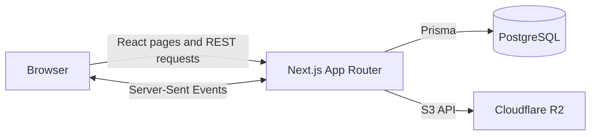

# Event Ticketing System

A full-stack event management, ticketing, and QR check-in application built with Next.js, PostgreSQL, and Cloudflare R2.

## Overview

Event Ticketing System gives organizers one workflow for publishing events, configuring ticket inventory and registration fields, assigning event staff, and monitoring attendance. Attendees can create accounts, reserve available tickets, and present generated QR codes at the venue. Assigned staff can scan or manually enter those codes to check guests in.

The Next.js App Router provides both the React interface and REST-style route handlers. Prisma persists users, events, orders, tickets, registration answers, staff assignments, and check-ins in PostgreSQL. Event posters are stored in Cloudflare R2, while organizer attendance screens receive updates through Server-Sent Events (SSE).

> Payment is simulated: successful reservations are recorded as paid, but no payment provider is integrated.

## Key Features

- Email/password authentication with bcrypt hashing and signed HTTP-only session cookies
- Organizer, staff, and attendee authorization in pages and API handlers
- Event creation with ticket types, capacity limits, and custom registration fields
- Attendee ordering with generated ticket and check-in identifiers
- QR display, camera scanning, manual code entry, and duplicate check-in prevention
- Organizer-only staff assignment and live attendance updates over SSE
- Validated event-poster uploads to S3-compatible Cloudflare R2 storage
- PostgreSQL schema, indexes, and versioned Prisma migrations

## Architecture



SSE subscriptions are held in application memory. They work within one long-lived application instance; a multi-instance deployment would require shared pub/sub to broadcast check-ins across instances.

## Tech Stack

- **Frontend:** Next.js 16, React 19, TypeScript, Tailwind CSS 4
- **Backend:** Next.js Route Handlers, Zod validation
- **Data:** PostgreSQL, Prisma 7, Prisma PostgreSQL adapter
- **Authentication:** JOSE JWTs, HTTP-only cookies, bcryptjs
- **Ticketing:** `qrcode`, ZXing browser scanner
- **Storage:** Cloudflare R2 through the AWS S3 client
- **Real-time updates:** Server-Sent Events

## Repository Structure

```text
app/                 Next.js pages, role-specific dashboards, and API routes
components/          Shared navigation and session UI
lib/                 Authentication, database, R2, and SSE utilities
prisma/              Schema, migrations, seed, and maintenance scripts
docs/                API and architecture notes
proxy.ts              Route-level role guards
```

## Local Development

### Prerequisites

- Node.js 20 or newer
- PostgreSQL
- A Cloudflare R2 bucket for poster upload and display

### Setup

```bash
git clone https://github.com/Leyang-Carl-Zhang/event-ticketing-system.git
cd event-ticketing-system
npm ci
cp .env.example .env
```

Fill in `.env`, then apply the committed migrations:

```bash
npx prisma migrate deploy
npm run seed
npm run dev
```

Open `http://localhost:3000`. The development seed creates sample accounts for all three roles. Do not use seeded accounts in a public deployment.

## Environment Variables

Copy [`.env.example`](.env.example) to `.env`. The application intentionally fails fast when `DATABASE_URL` or a sufficiently long `JWT_SECRET` is missing.

| Variable | Purpose |
| --- | --- |
| `DATABASE_URL` | PostgreSQL connection string |
| `JWT_SECRET` | Session-signing secret; minimum 32 characters |
| `SEED_PASSWORD` | Local-only password applied to development seed accounts |
| `R2_ACCOUNT_ID` | Cloudflare account identifier used to derive the endpoint |
| `R2_ENDPOINT` | Optional explicit S3-compatible endpoint |
| `R2_ACCESS_KEY_ID` | R2 API access key |
| `R2_SECRET_ACCESS_KEY` | R2 API secret |
| `R2_BUCKET` | Poster bucket name |

## API and Design Documentation

- [API reference](docs/API.md)
- [Architecture and security notes](docs/ARCHITECTURE.md)

## Deployment

The repository contains no Docker, Kubernetes, or provider-specific deployment manifest. It can be deployed to a Node.js-compatible Next.js host after provisioning PostgreSQL and R2, setting the environment variables, and running `npx prisma migrate deploy` against the target database.

Because the attendance broadcaster is process-local, a single application instance is the supported topology for live updates in this version.

## Verification

```bash
npm run lint
npx tsc --noEmit
npm run build
```

Database-backed flows additionally require PostgreSQL. Camera scanning requires HTTPS outside localhost and browser camera permission.

## License

Released under the [MIT License](LICENSE).
